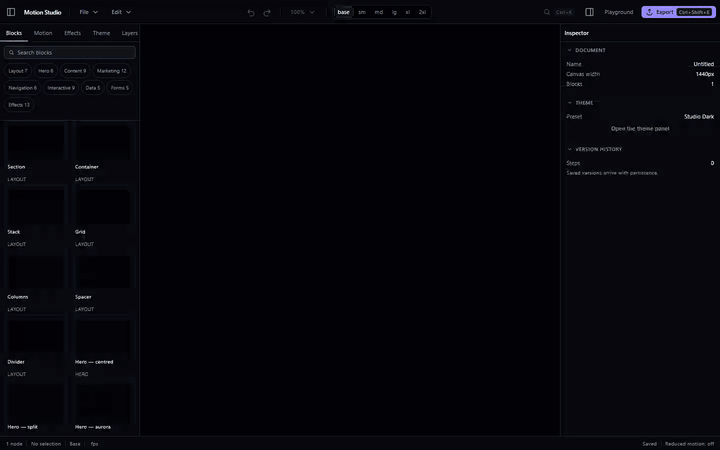
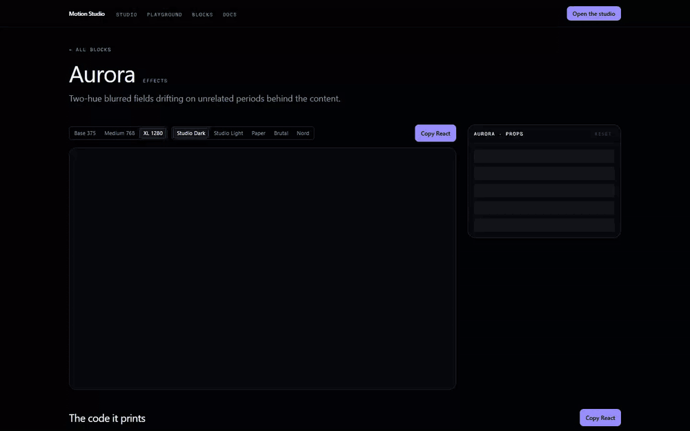
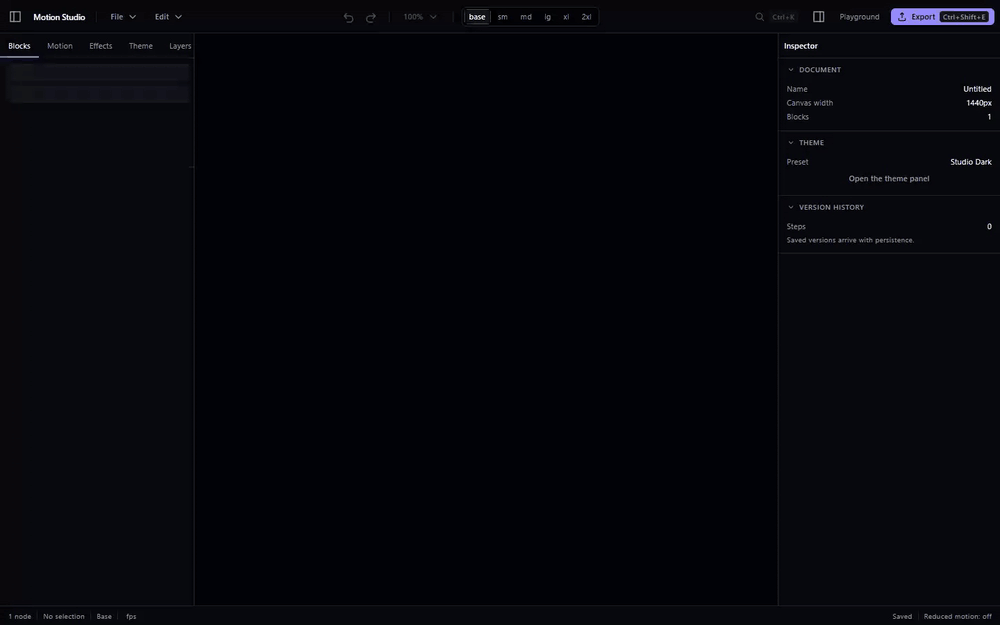
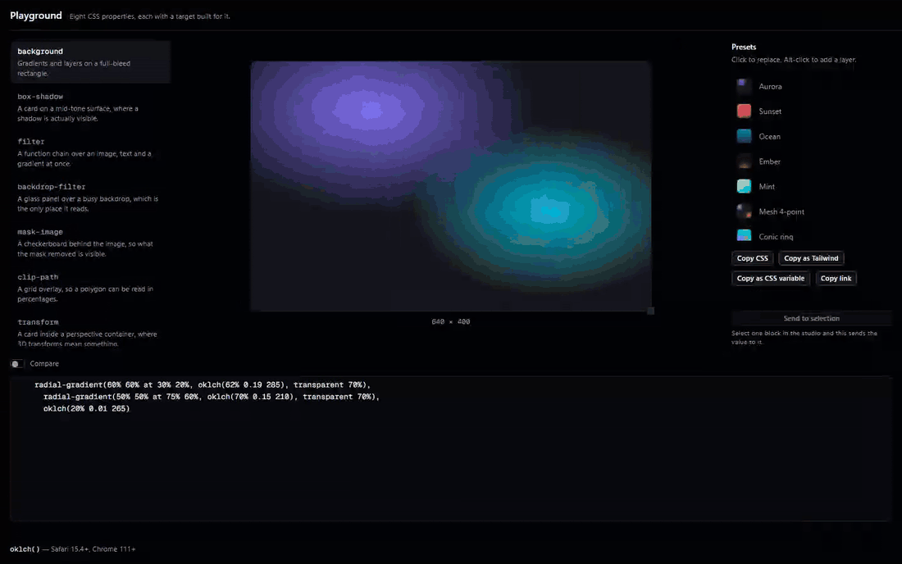
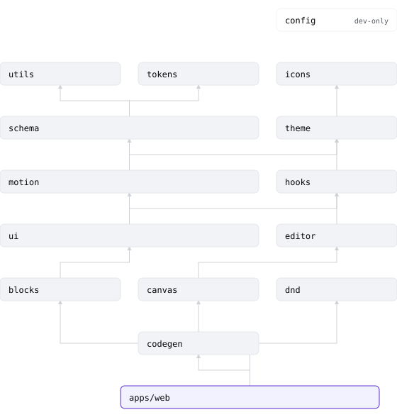

<div align="center">

# Motion Studio

**A visual editor for modern React interfaces.**
Infinite canvas · production-grade block registry · live motion engine · real code export.

[](https://github.com/yakupjoraev/Motion-Studio/actions/workflows/ci.yml)
[](docs/ENGINEERING_CONTRACT.md)
[](docs/PERFORMANCE.md)
[](LICENSE)



</div>

## What it is

Motion Studio is a visual editor for React interfaces: an infinite canvas, a registry of 72 typed
blocks, a motion engine with 51 presets, and a code generator that emits React, Next.js, standalone
HTML or a portable `.motion` document.

You compose on the canvas, tune the props in a generated inspector, and take the output away as
source. There is no runtime to install, no account, and nothing of this project is left in the code
it prints.

It is built as a product rather than as a demo: 8,273 unit tests, 200 end-to-end tests across three
browsers, 208 screenshot baselines, budgets enforced in CI, and a document for every subsystem in
[`docs/`](docs/).

## Why it exists

Every UI-effect library shows you a static grid of cards. You cannot feel a spring from a
screenshot, you cannot tell whether an effect survives contact with a real layout, and the moment
you want one of them you are reading a stranger's CSS in a devtools panel. The gap is not knowledge —
the techniques are published — it is that nothing lets you *manipulate* them against your own page.

Motion Studio closes that gap in one loop: parameters on the right, the live result in the middle,
generated source one keystroke away. The output is ordinary React with ordinary Tailwind classes and
no imports from this project, so the thing you export is a component you own rather than a dependency
you have taken on. The long version is [`docs/VISION.md`](docs/VISION.md).

## Features

| | |
| --- | --- |
| **Infinite canvas** | Zoom, pan, snap grid, alignment guides, rulers, multi-select, marquee, multi-frame breakpoint preview |
| **Block registry** | 72 typed, responsive, accessible blocks across nine categories — Hero, Marketing, Navigation, Data, Forms, and 13 effect layers |
| **Motion engine** | 51 presets over six channels — entrance, scroll, hover, cursor, continuous, exit — on a shared easing and spring vocabulary |
| **Inspector** | Typed controls generated from each block's Zod schema — colour, gradient, blur, shadow, radius, spacing, grid |
| **Playground** | Eight live CSS sandboxes: `background`, `box-shadow`, `filter`, `backdrop-filter`, `mask-image`, `clip-path`, `transform`, `transition` |
| **Theme engine** | Token-driven runtime theming; palette, radius, spacing, elevation and motion scales; light and dark |
| **Responsive engine** | Per-breakpoint prop overrides, visual breakpoint switching, and a side-by-side multi-frame view |
| **Export** | React (TSX), Next.js App Router, standalone HTML + CSS, portable `.motion` JSON, and the theme as tokens |
| **Undo/redo** | Patch-based history with coalescing — a slider drag is one undo step, not four hundred |
| **Keyboard-first** | Command palette (`⌘K`) and a full shortcut map, including keyboard drag from the palette to the canvas |
| **Accessibility** | Zero axe violations on every route, Lighthouse accessibility 100, reduced-motion honoured, contrast-checked tokens |

Two things the table does **not** claim, because they are not finished: reordering a block by
keyboard inside the layers tree moves the selection but not the node ([ADR-327](docs/DECISIONS.md)),
and no session with a real screen reader has been run — the accessibility work was verified with axe,
the accessibility tree and keyboard passes ([`ACCESSIBILITY_AUDIT.md`](ACCESSIBILITY_AUDIT.md)).

## The other three flows

**Grab one effect** — open a block page, tune it, copy the component. The code below the preview is
printed by the same exporter the studio uses, so what you copy is what ships.



**Tune motion** — apply a preset, drag its spring, watch the curve and the settling time follow. A
preset is a spec the printer reads, not a class name, so the numbers you drag to are the numbers in
the exported component.



**Live CSS** — eight sandboxes for the properties that are painful to write by hand. Drag a polygon
vertex and the value follows; send the result straight to the selected block.



## Quick start

```bash
corepack enable          # installs the pnpm version pinned in package.json
pnpm install
pnpm dev                 # http://localhost:3000
```

Requires **Node 22.18+** (`.nvmrc` pins 22.20.0) and **pnpm 10**. Nothing else — no database, no
environment file, no API keys.

On Windows, `corepack enable` writes into the Node installation directory and fails with `EPERM` in
an ordinary shell; either run that one command from an elevated terminal or install pnpm directly
with `npm install -g pnpm@10`. `pnpm install` then reads the pinned version from `packageManager`
either way. Verified from a clean clone on 2026-09-03: `install`, `lint`, `typecheck`, `build` and
`dev` all pass with no step missing from this section.

```bash
pnpm dev:storybook       # http://localhost:6006
pnpm test                # unit (Vitest), every package
pnpm test:e2e            # end-to-end (Playwright), three browsers
pnpm test:e2e:perf       # frame timings and listener counts, on a production build
pnpm lint                # Biome
pnpm typecheck           # tsc --noEmit, every package
pnpm build               # Turborepo pipeline
```

Generators, run when their source changes rather than on every build:

```bash
pnpm generate:tokens     # design tokens → CSS variables
pnpm generate:thumbnails # block thumbnails, deterministic; --verify to check them in CI
pnpm generate:fixtures   # the stress documents in e2e/fixtures/documents
pnpm generate:demos      # the four GIFs in this README, from a running production build
pnpm generate:diagram    # docs/assets/architecture.svg, from the docs page
pnpm stats               # the numbers in Project stats, counted
```

## Architecture

<div align="center">

<picture>
  <source media="(prefers-color-scheme: dark)" srcset="docs/assets/architecture-dark.svg">
  
</picture>

</div>

Fifteen packages, one deployable. Dependencies point one way — `apps/web` composes everything and
nothing points back into it — and the two seams that make the rest testable are the registry
(`editor` never imports `blocks`; it talks to a registry of Zod schemas) and the printer
(`codegen` runs under Node, with no React in its graph). Every package owns its `package.json`, its
`exports` map and its tests.

Full breakdown: [`docs/ARCHITECTURE.md`](docs/ARCHITECTURE.md).

## Documentation

The project is specified before it is built. Every subsystem has a document, and
[`DECISIONS.md`](docs/DECISIONS.md) records why each non-obvious thing is the way it is.

**Product** — [VISION](docs/VISION.md) · [PRODUCT](docs/PRODUCT.md) · [ROADMAP](docs/ROADMAP.md) · [GLOSSARY](docs/GLOSSARY.md)

**Engineering** — [ENGINEERING_CONTRACT](docs/ENGINEERING_CONTRACT.md) · [DECISIONS](docs/DECISIONS.md) · [ARCHITECTURE](docs/ARCHITECTURE.md) · [TECH_STACK](docs/TECH_STACK.md) · [CODE_STANDARDS](docs/CODE_STANDARDS.md) · [STATE_MANAGEMENT](docs/STATE_MANAGEMENT.md)

**Design** — [DESIGN_SYSTEM](docs/DESIGN_SYSTEM.md) · [UI_GUIDELINES](docs/UI_GUIDELINES.md) · [THEME_ENGINE](docs/THEME_ENGINE.md) · [ANIMATION_SYSTEM](docs/ANIMATION_SYSTEM.md)

**Subsystems** — [EDITOR_ENGINE](docs/EDITOR_ENGINE.md) · [CANVAS](docs/CANVAS.md) · [DRAG_AND_DROP](docs/DRAG_AND_DROP.md) · [COMPONENT_LIBRARY](docs/COMPONENT_LIBRARY.md) · [RESPONSIVE_ENGINE](docs/RESPONSIVE_ENGINE.md) · [EXPORT_ENGINE](docs/EXPORT_ENGINE.md) · [FILE_FORMAT](docs/FILE_FORMAT.md) · [PLAYGROUND](docs/PLAYGROUND.md) · [SHORTCUTS](docs/SHORTCUTS.md)

**Quality** — [PERFORMANCE](docs/PERFORMANCE.md) · [ACCESSIBILITY](docs/ACCESSIBILITY.md) · [TESTING](docs/TESTING.md) · [DEVOPS](docs/DEVOPS.md)

## Tech stack

Next.js 15 · React 19 · TypeScript 5.6 (strict) · Tailwind CSS v4 · Zustand + Immer ·
Motion (Framer Motion) · dnd-kit · Radix + React Aria · shadcn/ui · Zod ·
TanStack Query/Table · Storybook 8 · Vitest · Playwright · Biome · Turborepo · pnpm.

Rationale per choice, including the ones that were rejected:
[`docs/TECH_STACK.md`](docs/TECH_STACK.md).

## Project stats

| | | |
| --- | --- | --- |
| Blocks | 72 | 13 of them effect layers, across nine categories |
| Motion presets | 51 | entrance 13, hover 11, scroll 9, continuous 8, cursor 5, exit 5 |
| Unit tests | 8,273 | in 460 files |
| End-to-end tests | 200 | in 41 specs; 422 runs across the three browser projects |
| Screenshot baselines | 208 | a separate suite and a separate config — `e2e/visual.config.ts` |
| Coverage — editor / schema / codegen | 99.5 % / 95.9 % / 96.7 % | lines; branch floors are enforced per package in CI |
| Studio first-load JS | 249.3 KiB gzip | budget 250 KiB, enforced by `size-limit` |
| Landing first-load JS | 106.5 KiB gzip | budget 120 KiB |
| Lighthouse — landing, mobile | 96 / 100 / 100 / 100 | performance · accessibility · best practices · SEO |

Every number above is counted rather than remembered: `pnpm stats` prints the first six from the
registries, a test run and the build manifest. The Lighthouse row is the median of three throttled
mobile runs taken on 2026-09-03; `/blocks` scores 99, `/blocks/section` 95 and `/docs` 97 on the same
run. Scores move with the machine that takes them — [ADR-332](docs/DECISIONS.md) has the measurement
that says by how much — so treat them as "clears the 95 budget", which is what CI asserts.

The four demo GIFs are generated too: `pnpm generate:demos` drives each flow with Playwright against
a production build and re-encodes the recordings, so a stale screenshot cannot survive a UI change.

## Contributing

See [CONTRIBUTING.md](CONTRIBUTING.md). Conventional Commits, strict types, tests with behaviour,
and CI green before review. The rules every change obeys are in
[`docs/ENGINEERING_CONTRACT.md`](docs/ENGINEERING_CONTRACT.md) — it is short, and it is the contract.

## Design references

The visual bar for this project is set by [impeccable.style](https://impeccable.style), with
secondary influence from [Aceternity UI](https://ui.aceternity.com),
[Magic UI](https://magicui.design), and [React Bits](https://reactbits.dev). The chrome's density and
restraint follow Linear and Figma. Credit where it is due: these are the projects that made the
standard obvious.

**No reference implementation is adapted here.** Every effect and every block is built from an
understanding of the technique, against this project's schema, tokens, motion model and
reduced-motion policy; each doc comment states the technique in a paragraph. Licences were verified
on 2026-08-16 and recorded, per reference, in
[`packages/blocks/LICENSES.md`](packages/blocks/LICENSES.md) — two of the four forbid redistributing
component source, which is precisely what this project's export engine produces. The workflow is in
[`docs/DESIGN_REFERENCES.md`](docs/DESIGN_REFERENCES.md).

## License

MIT — see [LICENSE](LICENSE).
